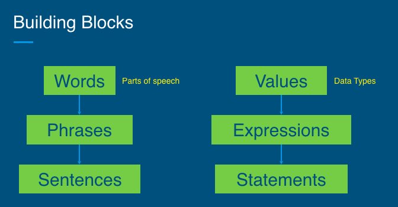

## 3.3.3 Data Types
### 3.3.3.1 print function
+ Functionality: print a string onto screen
+ Syntax
~~~~
print(a_string)
~~~~
+ Example
~~~~
# Comments are used to describe your code.
# Any code after Hash sign is ignored.
# enter your name
print("Ning Zhang")
print('Fisk University')

# my favorite movie
print("The Shawshank Redemption")

# my favorite song
print("My favorite song is " + "Telegraph Road")
~~~~
### 3.3.3.2 Data types
+ What are they?
  - Building blocks of computer science and programming
    + Spoken language: each word is a part of speech (noun, adjective, verb).
    + Programming language: each value has a data type.
  - Classification for values
  

#### integer
+ integer: number without decimal point
+ Commonly abbreviated as `int`.
+ Examples
~~~~
5
-40
0
13382
~~~~
####  float
+ float: number with decimal point
+ Comes from term `floating point number`
+ Examples
~~~~
3.14159
2.0
-9.5
~~~~
+ Why does integer vs float matter?
  - Computers are faster at doing math with integers
  - Floats sometimes don’t make sense (can you be in 2.35th place?) and vice versa
#### string
+ string: sequence of characters with single quotes or double quotes
+ Commonly abbreviated as `str`
+ Examples: 
~~~~
'abcdefg'
"Hello!"
"3.14"
~~~~
+ Why single quotes vs. double quotes?
  - You can use either single or double quotes, but not the same time. 
  - If you use single quote(s) inside a pair of double quotes, the single quote(s) will be viewed as regular character(s). 
  - If you use double quote(s) inside a pair of single quotes, the double quote(s) will be viewed as regular character(s).
~~~~
"Hello World"
'Hello World'
"My name’s Alicia"
# the following is not a string
'My name's Alicia
~~~~
#### boolean
+ boolean: has value true or false
+ Commonly abbreviated as bool
+ Examples
~~~~
True
False
~~~~
+ Practice: string or boolean?
~~~~
"cookie"
False
""
''
'False'
True
~~~~

    
Click to see the answer!

    "cookie" -> string 
    False -> boolean 
    "" -> empty string 
    '' -> empty string 
    'False' -> string 
    True -> boolean

#### Why are they important?
+ Do different things
+ Example: can do arithmetic (add, subtract, multiply, divide) on integers and floats, but not on strings and booleans
+ Know what data type to know how to use it
