# 3.3.9 For Loops

## 3.3.9.1 For Loops - in
+ `for loop`: control structure that runs block of code repeatedly by iterating over elements in sequence

~~~
for letter in 'cat':
  print(letter)
  
print("done")
~~~

+ Tracing for loops

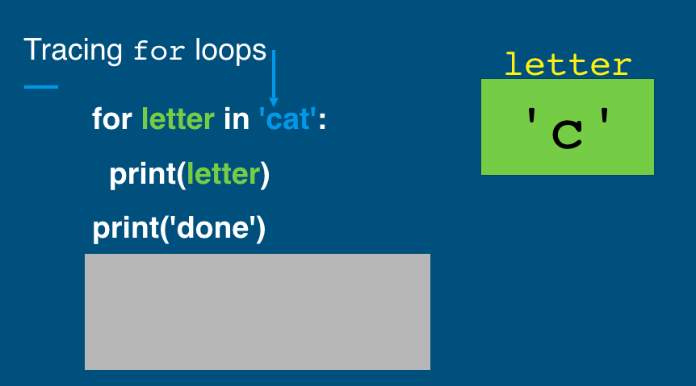

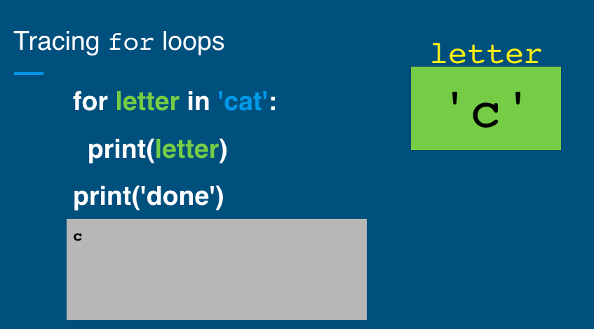

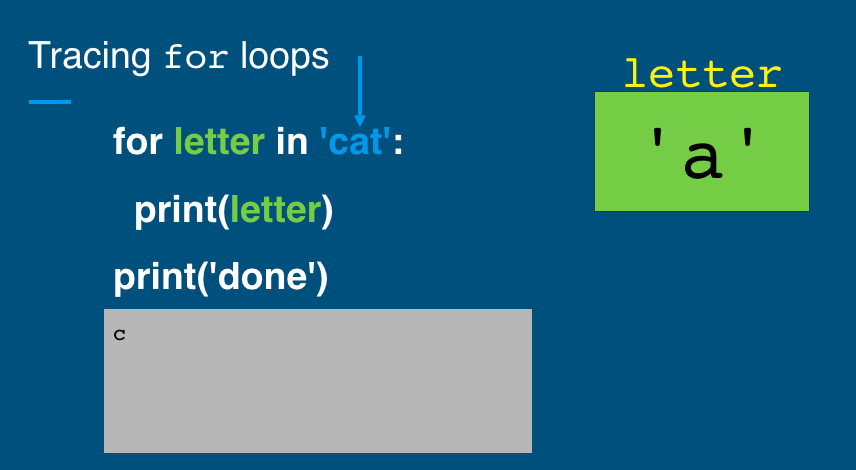

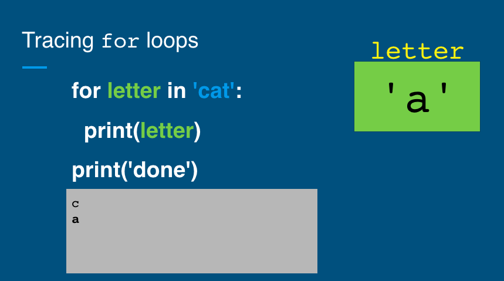

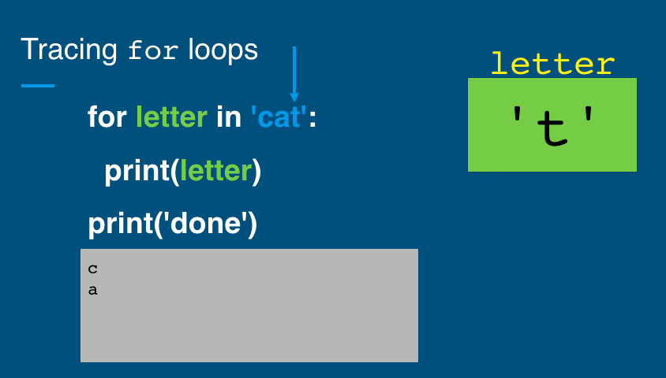

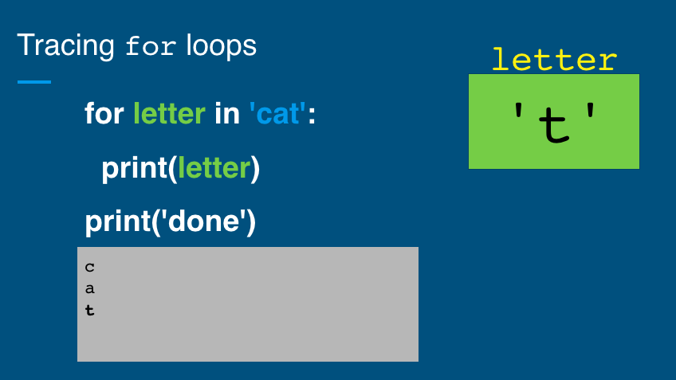

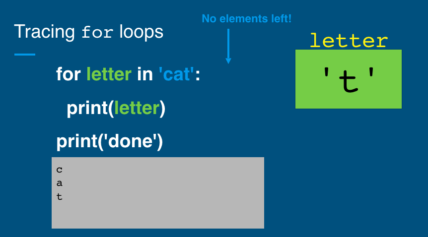

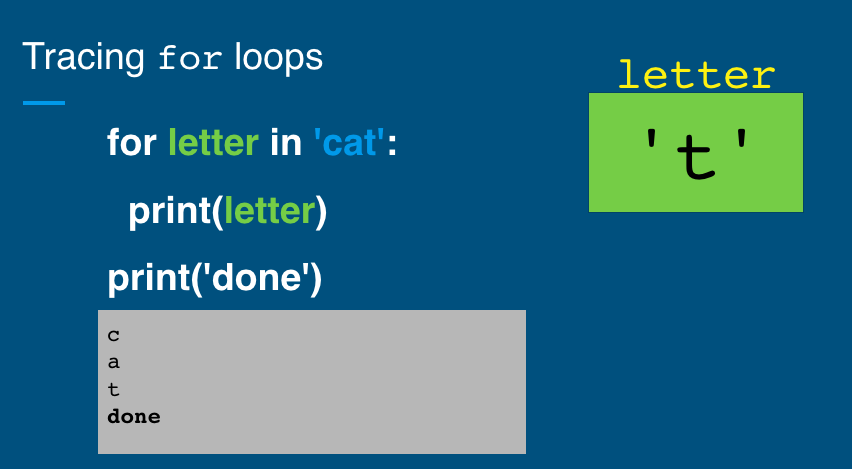

+ Accumulator Pattern

~~~~
word = 'friends'
result = ''
for char in word:
  result = result + char + '-'
print(result) # the result is f-r-i-e-n-d-s-
~~~~

+ `in` operator
  - `in` operator: checks if value exists in sequence
  - `in` expression evaluates to True if value exists

~~~~~
word = 'banana'
if 'n' in word:
  print('Found an n')
else:
  print('Did not find a n')
~~~~~

+ Practice: in operator
~~~~
'N' in 'Nashville, TN'
'n' in 'Nashville, TN''

char = ' '
char in 'Intro to Computer Science'

word = 'CS110'
char in word
~~~~

    
Click to see the explanation!

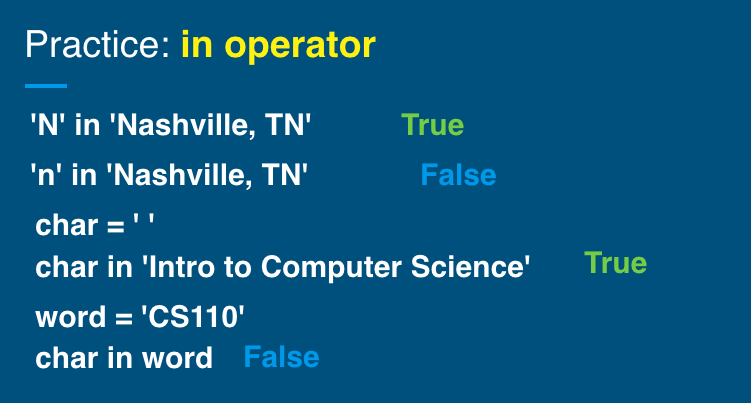

# Summary
+ What is an `in for loop`?
  - Control structure that runs block of code repeatedly by iterating over elements in sequence
  - Syntax
  ~~~~
  for [variable] in [sequence]:
    [execute code]
  ~~~~

+ Why is it important?
  - Write code once and run many times - do not need to copy and paste same code over and over

## 3.3.9.2 For Loops - range
+ `range()` returns sequence from start to end, incrementing by step
+ Use range() with for loops to repeat a loop when need numbers
+ Syntax: The range() function returns a sequence of numbers, starting from 0 by default, and increments by 1 (by default), and stops before a specified number.

~~~~~
for i in range(start, stop, step):
    [execution code]
~~~~~

|Parameter|Description|
|----|----|
|start|Optional. An integer number specifying at which position to start. Default is 0|
|stop|Required. An integer number specifying at which position to stop (not included).|
|step|Optional. An integer number specifying the incrementation. Default is 1|

+ Examples

~~~~
# print 0,1,2,3,4,5,6,7,8,9

for i in range(0, 10):
  print(i)
~~~~

~~~~~
range(5, 8)             # returns 5 6 7
range(0, 5)             # returns 0 1 2 3 4
range(0, 5, 1)          # returns 0 1 2 3 4
range(5)                # returns 0 1 2 3 4
range(0, 5, 2)          # returns 0 3
~~~~~

+ Tracing for loops

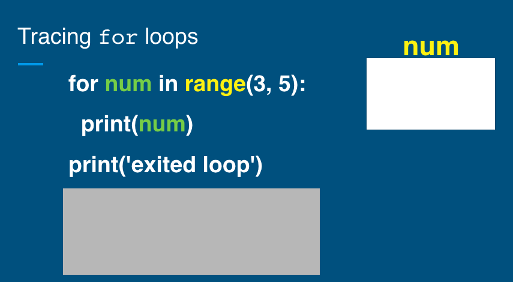

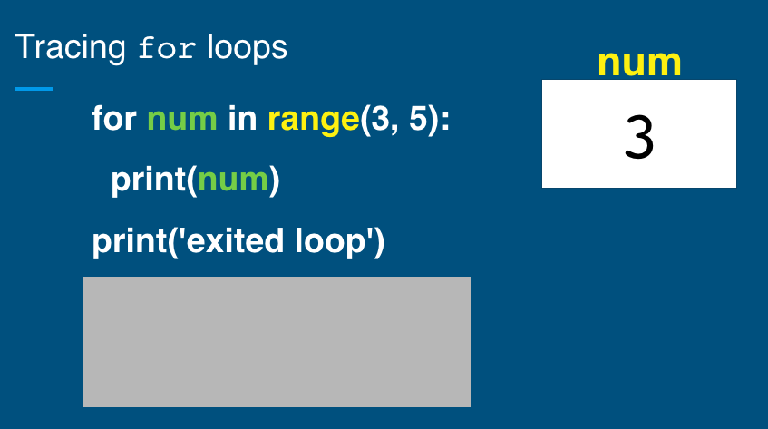

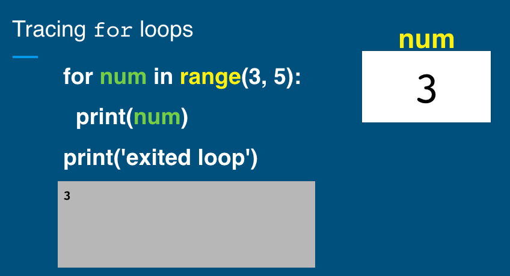

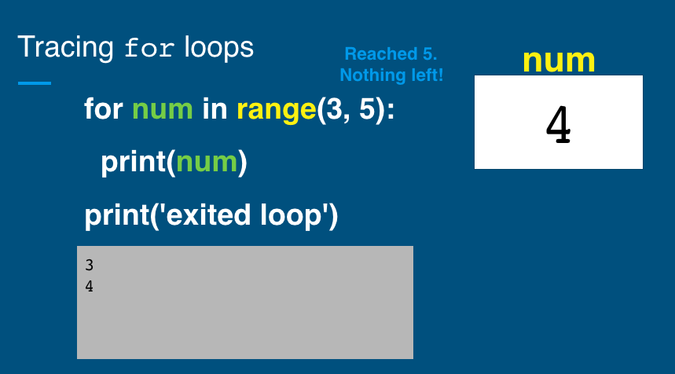

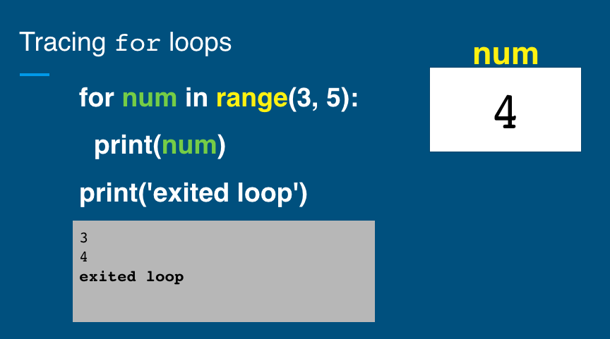

# Summary: in vs. range()

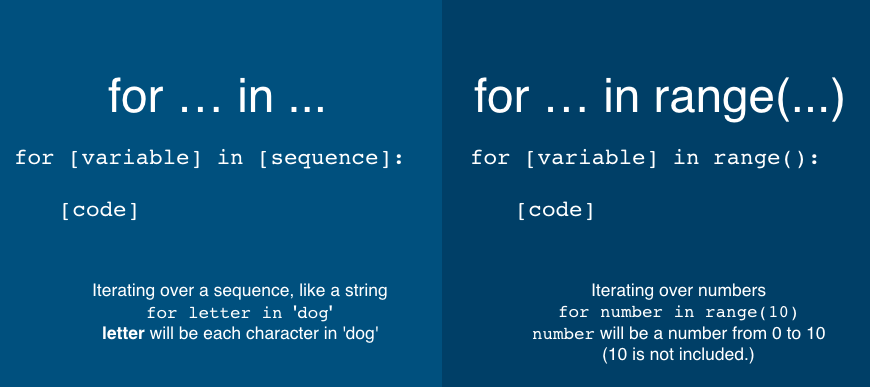
