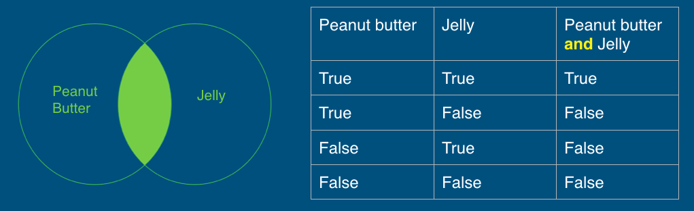
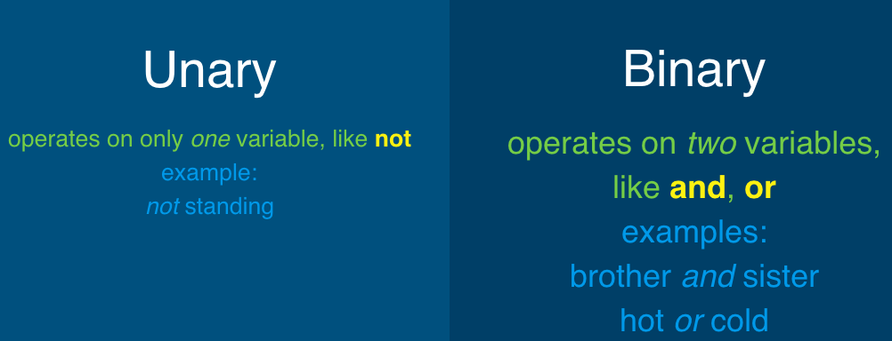
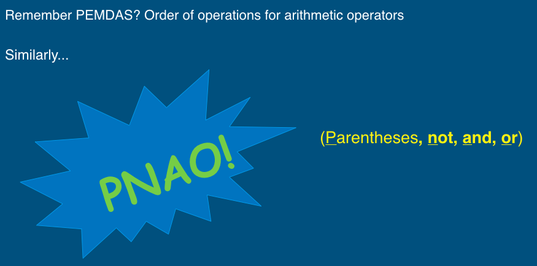
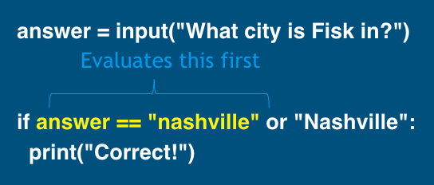
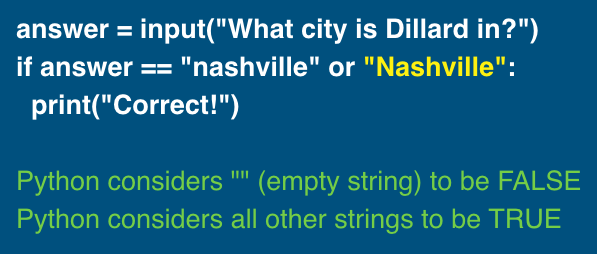
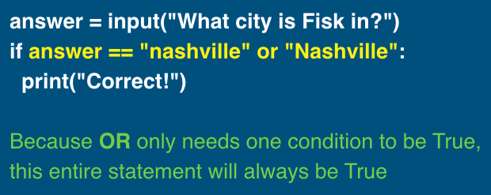

## 3.3.8 Logical Operators
### Questions: True or False
+ Are your favorite activities hiking `AND` traveling?
+ Have you had coffee `OR` tea this morning?
+ Are you `NOT` excited for the weekend?
+ Do we have Monday `AND` `NOT` Tuesday off for Labor Day?

### 3.3.8.1 What are Logical Operators?
+ Reminder: Arithmetic operators (`+`, `-`, `*`, `/`) to combine numbers
+ Logical operators: combine booleans
  - `and`
  - `or`
  - `not`
#### Logical Operators: `AND`
+ `AND` returns true only if both operands are true.

+ Practice: Milkshake Time!
~~~~
vanilla = True
chocolate = True
strawberry = False

vanilla and strawberry
vanilla and chocolate
chocolate and vanilla
chocolate and strawberry
strawberry and strawberry
~~~~

    
Click to see the answer!

    vanilla and strawberry    ->   False 
    vanilla and chocolate     ->   True 
    chocolate and vanilla     ->   True 
    chocolate and strawberry  ->   False 
    strawberry and strawberry ->   False

#### Logical Operators: `OR`
+ `OR` returns true if either (or both) operand is true.

+ Practice: Outdoor Activities!
~~~~
hiking = True
running = False
biking = False

hiking or running
hiking or biking
biking or hiking
biking or running
running or biking
~~~~

    
Click to see the answer!

    hiking or running  ->     True 
    hiking or biking   ->     True 
    biking or hiking   ->     True 
    biking or running  ->     False 
    running or biking  ->     False

#### Logical Operators: `NOT`
+ `NOT` inverts (gives opposite value of) the value of its operand.

+ Practice: Favorite Colors!
~~~~
blue = True
red = False
green = True

not blue
not red
not green
~~~~

    
Click to see the answer!

    not blue  ->   False   
    not red   ->   True    
    not green ->   False   

#### How is `not` different from `and` and `or`?

#### Combining Operators

+ Practice 1:
~~~~
True and not False
(False or True) and False
not (True or False) or True
~~~~

    
Click to see the answer!

    True and not False           ->       True 
    (False or True) and False    ->       False 
    not (True or False) or True  ->       True

+ Practice 2:  Animals on a Farm!
~~~~
dog = False
chicken = True
sheep = True

not dog or not chicken and sheep
chicken and dog or not sheep
not chicken or not sheep or dog
dog and not sheep or chicken 
~~~~

    
Click to see the answer!

    not dog or not chicken and sheep   ->   True 
    chicken and dog or not sheep       ->   False  
    not chicken or not sheep or dog    ->   False 
    dog and not sheep or chicken       ->   True

+ Practice 3: Find the bug in the following code.
~~~~
answer = input("What city is Fisk in?")
if answer == "nashville" or "Nashville":
  print("Correct!")
~~~~

    
Click to see the explanation!

  

  

  

    
Click to see the correct code!

    answer = input("What city is Fisk in?")
    if answer == "nashville" or answer == "Nashville":
      print("Correct!")

