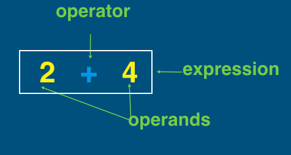

## 3.3.4 Operators
+ Key Terms
  - **operator**: symbol performing specific computation on set of values
  - **expression**: combination of operators and values evaluating to single value
+ Evaluating expressions

### 3.3.4.1  Arithmetic Operators
~~~~
+    Add(Adding strings together is called concatenation)
-    Subtract
*    Multiply
/    Divide
**  Exponent
~~~~
### 3.3.4.2 Floor Division
+ `//` divides two numbers and rounds result down to next integer.

+ Examples:
~~~~
5 // 2 evaluates to 2
5.0 // 2.0 evaluates to 2.0
42 // 10 evaluates to 4
9 // 9 evaluates to 1
9.0 // 9.0 evaluates to 1.0
~~~~

+ Practice
~~~~
56 // 5
60.60 // 7
3 // 3
88.123 // 9.0
~~~~

    
Click to see the answer!

    56 // 5 = 11 
    60.60 // 7 = 8.0 
    3 // 3 = 1 
    88.123 // 9.0 = 9.0 

### 3.3.4.3 Modulo

+ `%` computes remainder after division.

+ For example:
~~~~
5 % 2 evaluates to 1
5.0 % 2.0 evaluates to 1.0
24 % 10 evaluates to 4
9 % 9 evaluates to 0
9.0 % 9.0 evaluates to 0.0
~~~~

+ Practice
~~~~
56 % 5
60.0 % 7.0
3 % 3
88.5 % 9.0
~~~~

    
Click to see the answer!

    56 % 5 = 1 
    60.0 % 7.0 = 4.0 
    3 % 3 = 0 
    88.5 % 9.0 = 7.5 

### Summary
+ If any operand is float, evaluated value is float.
+ If all operands are integers, evaluated value is intege.
+ EXCEPT DIVIDE `/`, evaluated value is always float .

### 3.3.4.4 Order of Operations
+ 1. Parentheses
+ 2. Exponents
+ 3. Multiplication and Division
+ 4. Addition and Subtraction

~~~~
2 + 1 * 5 - 6 / 2 = 2 + 5 - 3 = 4

3 + (1 + 4) * 2 = 3 + 5 * 2 = 3 + 10 = 13

'a' + 'b' * 2 + 'c' = 'a' + 'bb' + 'c' = 'abbcc'
~~~~

### Summary
+ Values have different data types - can be integers, floats, booleans, or strings.
+ Can use arithmetic operators on integers and floats, concatenate strings.
+ Values and operators make up expressions.
+ Computers evaluate expressions down to single value.
