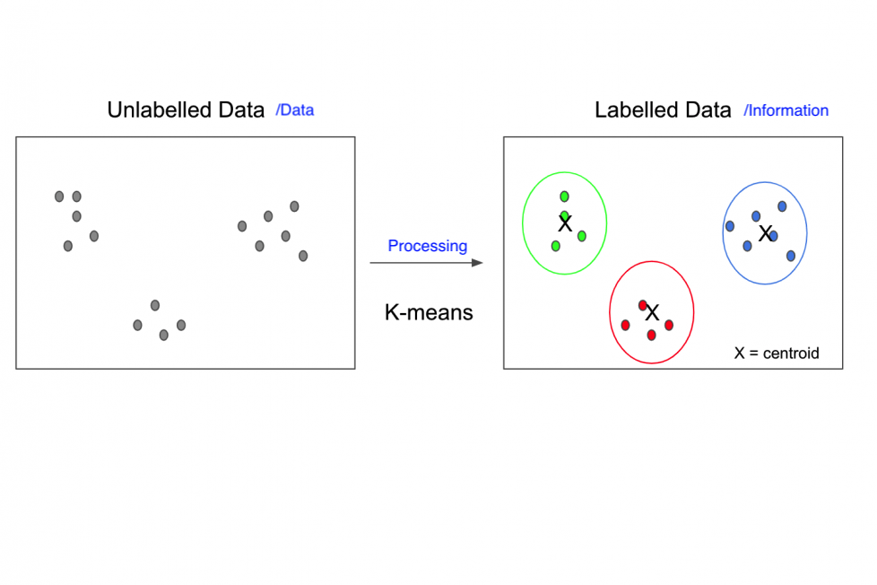

# CSCI100: Introduction to Computing
# Dr. Ning Zhang
# Topic 1: Computer Architectures

# 1. What is Computer?

## 1.1 Computers are everywhere.
+ The modern electronic computer is certainly one of the most influential inventions of the twentieth century.
+ Computers have entered almost every arena of human society. They operate in our homes, our workplaces, and our schools. They come in so many shapes and sizes that it is sometimes difficult to recognize them: while laptop and desktop computers are commonplace, ATM machinecomputers can also be found in home electronics, automobiles, airplanes, automatic teller machines (ATMs), security systems, and many other devices and situations. Many of the world's societies depend heavily on computers in the operation of their transportation systems, commerce, utilities, law enforcement, governance, and more.

+ [Internet of Things](https://en.wikipedia.org/wiki/Internet_of_things)

## 1.2 What is computer?
+ A computer is an electronic device, operating the instructions stored in its own memory.
+ A computer can accept data, process the data, produce results, and store the results for future use.
+ A typical computer architecture
  - Note that 
Primary memory usually refers to Random Access Memory (RAM), while secondary storage refers to devices such as hard disk drives, solid state drives, removable “USB” drives, CDs, and DVDs.

## 1.3 Information Processing Cycle

+ Data v.s. Information
  - **Data** is a collection of unprocessed items, which can include text, numbers, images and so on.
  - **Information** conveys meaning and is useful to people.

+ Example
  - At a restaurant, a single customer’s bill amount is data. However, when the restaurant owners collect and interpret multiple bills over a range of time, they can produce valuable information, such as what menu items are most popular and whether the prices are sufficient to cover supplies, overhead, and wages.
  - Data Mining - Clustering
  
  

## 1.4 Four Functions about computer
+ The four functions of a computer actually explain the core reasons why it was built. They include:
  - Data input
  - Data processing.
  - Information output.
  - Data and information storage.

### 1.4.1 Data Input
+ Every computer is designed with data input as a first function, an activity which is accomplished via input devices.
+ Data entry is done manually, automatically or both. Manual input is done via add-on peripherals like the keyboard, mouse and stylus. Input can also be accomplished via vocal dictation applications and body gestures peripherals like Kinect and biometric devices. Elsewhere, data input is also done using secondary storage media and networking interfaces.
+ Application software used for this purpose will also dictate what data is entered. Word processing software is designed to input basic alphanumerical data, while a photo editing application is used to input and manipulate images.
+ Automated applications and robotics can also be used to intelligently feed data into the computer on station or remotely. As an example, tallying of electoral process can be accomplished remotely and automatically.

### 1.4.2 Data Processing
+ Data processing is the core function of a computer. Processing involves manipulation of raw data into before converting it into meaningful information. Usually, data is in raw form, and will thus undergo processing before dissemination for user consumption.
+ The 'brain' of the computer where data is processed is referred to as the microprocessor. It is also commonly known as the central processing unit (CPU) or accelerated processing unit (APU).
+ The processing chips in modern personal computing devices continue to evolve and outperform its predecessors. One particular evolution is the merger of microprocessor and graphics processing unit (GPU) into what is now known as accelerated processing unit. The merger allows for the integration of powerful graphics processing abilities inside the traditional arithmetic and logical computations of the processor.([The Growth of Computer Processing Power](https://www.offgridweb.com/preparation/infographic-the-growth-of-computer-processing-power/))
+ Besides the microprocessor, the dynamic random access memory (DRAM) and static random access memory (SRAM) are integral parts of data processing. Data entered via input devices is stored temporarily in DRAM, then transferred to SRAM from where the microprocessor manipulates it.

+ Discussion: The more, the better?
  - [THE SPACE SHUTTLE VS. SMART PHONES](https://dospace.org/blog/the-space-shuttle-vs-smart-phones)

### 1.4.3 Information Output
+ When raw data has been manipulated by the microprocessor, the outcome is meant to be disseminated for useful purposes. The output is thus referred to as information and is beneficial to the computer user.
+ Processed data or information can be
  - viewed as alphanumeric, images and video via a display hardware
  - listened to as audio files by use of a speaker
  - printed as hard copy output onto paper
  - printed as 3D models

### 1.4.4 Data and Information Storage
+ A computer can store information internally and externally. The hard disk drive (HDD) and/or solid-state disk drive (SSD) are internal storage devices and serve to protect and house all data and information on a computer. In bigger systems, the RAID system is used. Multiple disk drives operate simultaneously to ensure data and information integrity.
+ External storage is achieved through accessories that attach externally to the computer. They include external drives and optical disks.
+ Better still data and information can be stored online in cloud solutions for a fee or for a fee if large space is required.
+ Storage integrity is a crucial phase that can actually determine the worth of a computer system. 

## 1.5 Fundamentals of Computer Systems: Hardware and Software
+ **Hardware** - Physical components that make up a computer system.
+ **Software** - Computer programs and related data that provide the instructions for telling computer hardware what to do and how to do it.

+ The relationship between Hardware and Software

## 1.6 Data Representation
+ Everything on a computer is represented as streams of binary numbers. Audio, images and characters.

### 1.6.1 Data Formats
+ Audio, images and characters all look like binary numbers in machine code. These numbers are encoded in different data formats to give them meaning,
  - Audio is encoded as audio file formats. E.g., mp3, WAV, ACC...
  - Video is encoded as video file formats. E.g., MPEG4, H264...
  - Text is encoded in character sets. E.g., ASCII, Unicode...
  - Images are encoded as file formats. E.g., BMP. JPEG, PNG...
#### ASCII
+ SCII is short for American Standard Code for Information Interexchange, 
+ ASCII is an standard that assigns letters, numbers, and other characters within the 256 slots available in the 8-bit code.

+ Characters must be encoded in binary.

+ ASCII maps characters to numbers.

# 2. History of Computers

## 2.1 Cogs and Calculators
+ In 1642, aged only 18, French scientist and philosopher Blaise Pascal (1623–1666) invented the first practical mechanical calculator, the **Pascaline**, to help his tax-collector father do his sums.
+ The machine had a series of interlocking cogs (gear wheels with teeth around their outer edges) that could add and subtract decimal numbers. 

+ In 1671, German mathematician and philosopher Gottfried Wilhelm Leibniz (1646–1716) came up with a similar but more advanced machine. Instead of using cogs, it had a "stepped drum" (a cylinder with teeth of increasing length around its edge), an innovation that survived in mechanical calculators for 300 hundred years. The Leibniz machine could do much more than Pascal's: as well as adding and subtracting, it could multiply, divide, and work out square roots. Another pioneering feature was the first memory store or "register." Apart from developing one of the world's earliest mechanical calculators, Leibniz is remembered for another important contribution to computing: he was the man who invented binary code.

## 2.2 Engines of Calculation
+ Charles Babbage (1791-1871) , computer pioneer, designed the first automatic computing engines. He invented computers but failed to build them. The first complete Babbage Engine was completed in London in 2002, 153 years after it was designed.
+ Neither the abacus, nor the mechanical calculators constructed by Pascal and Leibniz really qualified as computers.(it needs a human operator)
+ A computer, on the other hand, is a machine that can operate automatically, without any human help.

## 2.3 Turing machine
+ Alan Turing(1912-1954) was a brilliant Cambridge mathematician whose major contributions were to the theory of how computers processed information.

## 2.4 The first modern computers
+  The first large-scale digital computer appeared in 1944 at Harvard University, built by mathematician  Howard Aiken (1900-1973), sponsored by IBM. It is also known as **Harward Mark I**.

+ **Colossus** was the world’s first electronic, digital, programmable computer. British codebreakers used Colossus to read secret
German messages during World War II.

## 2.5 First [Compiler](https://en.wikipedia.org/wiki/Compiler)
+ Grace Hopper (1906 -1992) was an American computer scientist and United States Navy Rear Admiral. She invented the first compiler for a computer programming language. The A-0 system (Arithmetic Language version 0), was the first compiler ever developed for an electronic computer.

## 2.6 A legendary bug
+ In 1947, a physical malfunction in the Mark II computer was traced back to a moth stuck in one of the relays. Grace Hopper taped it to the operations logbook with the annotation ”First actual case of bug being found”.

## 2.7 The microelectronic revolution
+ Integrated circuits , as much as transistors, helped to shrink computers during the 1960s. As the 1960s wore on, integrated circuits became increasingly sophisticated and compact. Soon, engineers were speaking of **large-scale integration(LSI)**, and then **very large-scale integrated (VLSI)**.

## 2.8 Modern computers

## 2.9 Future
+ Q: How about the future?
+ A: Quantum Computer
  - [Quantum computing](https://en.wikipedia.org/wiki/Quantum_computing)
  - [Quantum_supremacy](https://en.wikipedia.org/wiki/Quantum_supremacy)

# 3 Computer System Components:Computer Parts & Functions
## 3.1 Computer System Components
+ Input Devices
+ Output Devices
+ System Unit

### 3.1.1 Input Devices
+ An input device is any hardware component that allows you to enter data and instructions into a computer.

### 3.1.2 Output Devices
+ An output device is any hardware component that conveys information to one or more people.

### 3.1.3 System Unit
+ The system unit is a case that contains the electronic components of the computer that are used to process data.

#### 3.1.3.1 [Motherboard](https://en.wikipedia.org/wiki/Motherboard)
+ It holds and allows communication between many of the crucial electronic components of a system, such as the central processing unit (CPU) and memory, and provides connectors for other [peripherals](https://en.wikipedia.org/wiki/Peripheral).

#### 3.1.3.2 [central processing unit (CPU)](https://en.wikipedia.org/wiki/Central_processing_unit)
+ A central processing unit (CPU), also called a central processor, main processor or just processor, is the electronic circuitry that executes instructions comprising a computer program.
+ The CPU performs basic arithmetic, logic, controlling, and input/output (I/O) operations specified by the instructions in the program. 

+ [Types of CPUS](https://digitalworld839.com/types-of-central-processing-unit/)

+ [Core vs. Processor](https://www.educba.com/core-vs-processor/)

#### 3.1.3.3 [Heat Sink](https://en.wikipedia.org/wiki/Heat_sink)
+ A heat sink (also commonly spelled heatsink[1]) is a passive heat exchanger that transfers the heat generated by an electronic or a mechanical device to a fluid medium, often air or a liquid coolant, where it is dissipated away from the device, thereby allowing regulation of the device's temperature.
+ In computers, heat sinks are used to cool CPUs, GPUs, and some chipsets and RAM modules.

#### 3.1.3.4 [Random-access memory(RAM)](https://en.wikipedia.org/wiki/Random-access_memory)
+ Random-access memory (RAM; /ræm/) is a form of computer memory that can be read and changed in any order, typically used to store working data and machine code.
+ A random-access memory device allows data items to be read or written in almost the same amount of time irrespective of the physical location of data inside the memory, in contrast with other direct-access data storage media (such as hard disks, CD-RWs, DVD-RWs and the older magnetic tapes and drum memory), where the time required to read and write data items varies significantly depending on their physical locations on the recording medium, due to mechanical limitations such as media rotation speeds and arm movement.

#### 3.1.3.5 [Hard disk drive](https://en.wikipedia.org/wiki/Hard_disk_drive)
+ A hard disk drive (HDD), hard disk, hard drive, or fixed disk[b] is an electro-mechanical data storage device that stores and retrieves digital data using magnetic storage with one or more rigid rapidly rotating platters coated with magnetic material.
+ [How hard drive works](https://cs.stanford.edu/people/nick/how-hard-drive-works/#:~:text=The%20hard%20drive%20contains%20a,the%20stored%200's%20and%201's)

#### 3.1.3.5 [Graphics processing unit(GPU)](https://en.wikipedia.org/wiki/Graphics_processing_unit)
+ A graphics processing unit (GPU) is a specialized electronic circuit designed to manipulate and alter memory to accelerate the creation of images in a frame buffer intended for output to a display device.
+ [cpu vs. gpu](https://www.intel.com/content/www/us/en/products/docs/processors/cpu-vs-gpu.html)

# 4 Category of Computers
+ Personal computers(desktop)
+ Mobile computers and mobile devices
+ Servers
+ Supercomputers
+ Embedded Computers

## 4.1 Personal Computers
+ Two most popular styles of Personal Computer

+ PC usually use a Windows operating system.

+ Apple computers usually use a Macintosh operating system

## 4.2 Mobile Computers

## 4.3 Servers
+ A server is a computer that serves up information to other computers on a network.
+ A server controls access to the hardware, software, and other resources on a network and provides a centralized storage area for programs, data, and information.

## 4.4 Supercomputers
+ A supercomputer is the fastest, most powerful computer and the most expensive.
+ The fastest supercomputers are capable of processing more than one quadrillion(10^15) instructions in a single second.
+ Supercomputers are used for data-intensive and computation-heavy scientific and engineering purposes such as quantum mechanics, weather forecasting, oil and gas exploration, molecular modeling, physical simulations, aerodynamics, nuclear fusion research and cryptoanalysis.
+ [Top 500 Supercomputers](https://www.top500.org/)

## 4.5 Embedded Computers
+ An embedded computer is a special- purpose computer that functions as a component in a larger product.

# References
+ [Computers Are Everywhere](https://cs.calvin.edu/activities/books/rit/chapter1/lesson1/index.htm)
+ [4 Functions of a Computer](https://turbofuture.com/computers/The-Four-Functions-Of-A-Computer)
+ [History of Computers](https://www.explainthatstuff.com/historyofcomputers.html)
+ [historyofcomputers](http://www.explainthatstuff.com/historyofcomputers.html)

