# CSCI110
# Dr. Ning Zhang
# Topic 3: Progamming Languages and Applications
+ Programming Languages
+ Applications
+ **Python**
# 3.1 Programming Languages
## 3.1.2 Computer Languages
### 3.1.2.1 Machine Language
+ **Machine language** is a set of instructions executed directly by CPU.
+ **Machine language** is the elemental language of computers, comprising a long sequence binary digital zeros and ones.
+ CPU implements machine language instructions.
+ CPU understands a low level machine language.
+ Each machine language instruction is extremely simple.
  - add 2 numbers
  - compare 2 numbers
  - get input from keyboard
  - display information on screen

### 3.1.2.2 Assembly(lower-level) Language
+ A processor understands only machine language instructions, which are strings of 1's and 0's.
+ However, machine language is too obscure and complex for using in software development.
+ So, the low-level assembly language is designed for a specific family of processors that represents various instructions in symbolic code and a more understandable form.
+ Advantages of Assembly Language
  - Having an understanding of assembly language makes one aware of 
    + How programs interface with OS, processor, and BIOS;
    + How data is represented in memory and other external devices;
    + How the processor accesses and executes instruction;
    + How instructions access and process data;
    + How a program accesses external devices.
  - Other advantages of using assembly language are 
    + It requires less memory and execution time;
    + It allows hardware-specific complex jobs in an easier way;
    + It is suitable for time-critical jobs;
    + It is most suitable for writing interrupt service routines and other memory resident programs.
+ Assembly code is converted into executable machine code by a utility program referred to as an **assembler**.

### 3.1.2.3 High-level Language
+ The term `high-level language` (HLL) refers to the computer programming languages that not only allow the use of symbolic operators to signify operations and of symbolic names to represent data and data structures, but are also structured with syntax and semantics to describe the computing algorithm.
+ A high-level language enables a programmer to write programs that are more or less independent of a particular type of computer. 
+ Such languages are considered high-level because they are closer to human languages and further from machine languages.
+ A high-level programming language is a programming language with strong abstraction from the details of the computer. 
+ In contrast to low-level programming languages, it may use natural language elements, be easier to use, or may automate (or even hide entirely) significant areas of computing systems (e.g. memory management), making the process of developing a program simpler and more understandable than when using a lower-level language.
+ List of some popular higher-level languages:
  - **Python**(we'll learn Python in this class.)
  - Java
  - JavaScript
  - C++
  - C#
  - Ruby
  - Perl
  - PHP
  - GO
  - Rust

### 3.1.3 Source Code
+ Programmer writes source code of a program in a high-level language, say, Python.
+ The high level language program is called the source code.
+ High level computer languages
  - Sequential code
  ~~~~
  a = 1
  b = 2
  c = a + b
  ~~~~
  - Selection code
  ~~~~
  a = 1
  if a<0:
      print(a, "is negtive.")
  else:
      print(a, "is NOT negtive.")
  ~~~~
  - Iteration code
  ~~~~
  for i in [1,2,3,4]:
      print(i)
  ~~~~
### 3.1.4 Complier and Interpreter
#### 3.1.4.1 Complier
+ **Compiler** translates the source code into a large number of machine code instructions.
+ A compiler is a language processor that translates an **entire** high-level language program into its machine language equivalent before the program is executed.
+ The compiler produces an executable file from the source code (e.g., .exe from C++), and it is finished.
+ Every high-level language requires its own compiler.
+ The high level language program is called the source code.
+ The machine language translation is called the object code.

#### 3.1.4.2 Interpreter
+ Some dynamic languages(e.g., Java, Javascript, Python) can be implemented by an interpreter.
+ In computer science, an interpreter is a computer program that directly executes instructions written in a programming or scripting language, without requiring them previously to have been compiled into a machine language program.
+ Interpreter does not create an object code.
+ Interpreter is a program which runs other code.
+ Interpreter looks at one line at a time, then does that action, in the moment.
+ Then the interpreter proceeds to the next line.
#### 3.1.4.3 Compilers versus interpreters
|Interpreter|Complier|
|----|----|
|Interpreter translates just one statement of the program at a time into machine code.|Compiler scans the entire program and translates the whole of it into machine code at once.|
|An interpreter takes very less time to analyze the source code. However, the overall time to execute the process is much slower.|A compiler takes a lot of time to analyze the source code. However, the overall time taken to execute the process is much faster.|
|An interpreter does not generate an intermediary code. Hence, an interpreter is highly efficient in terms of its memory.|A compiler always generates an intermediary object code. It will need further linking. Hence more memory is needed.|
|Keeps translating the program continuously till the first error is confronted. If any error is spotted, it stops working and hence debugging becomes easy.|A compiler generates the error message only after it scans the complete program and hence debugging is relatively harder while working with a compiler.|
|Interpreters are used by programming languages like Ruby and Python for example.|Compliers are used by programming languages like C and C++ for example.|
#### 3.1.4.4 Current trend
+ Current trend is towards [dynamic languages](https://en.wikipedia.org/wiki/Dynamic_programming_language).
+ It’s attractive to save some programmer time at the expense of some CPU memory use.
+ CPU cheap, programmer relatively rare/ expensive.

# 3.2 Applications

+ An app is a type of software in the computer that allows you to perform specific tasks.
+ Types of Applications

## 3.2.1 Desktop Apps
+ Applications for desktop or laptop computers are sometimes called **desktop applications**.

## 3.2.2 Mobile Apps
+ And those for mobile devices are called **mobile apps**.

### 3.2.3 Web Application
+ A web application (or web app) is application software that runs in a web browser, unlike software programs that run locally and natively on the operating system (OS) of the device.
+ Web applications are delivered on the `World Wide Web` to users with an active network connection.
+ Web applications are usually coded in browser-supported language such as JavaScript and HTML as these languages rely on the browser to render the program executable.
+ Some applications are dynamic, requiring server-side processing. Others are completely static with no processing required at the server.
+ The web application requires a web server to manage requests from the client, an application server to perform the tasks requested, and, sometimes, a database to store the information.
#### 3.2.3.1 A typical web application flow
+ 1. User triggers a request to the web server over the internet, either through a web browser or the application’s user interface
+ 2. Web server forwards this request to the appropriate web application server
+ 3. Web application server performs the requested task – such as querying the database or processing the data – then generates the results of the requested data
+ 4. Web application server sends results to the web server with the requested information or processed data
+ 5. Web server responds back to the client with the requested information that then appears on the user’s display
#### 3.2.3.2 Example of a web application
+ Web applications include online forms, shopping carts, word processors, spreadsheets, video and photo editing, file conversion, file scanning, and email programs such as Gmail, Yahoo and AOL. Popular applications include Google Apps and Microsoft 365.
+ Google Apps for Work has Gmail, Google Docs, Google Sheets, Google Slides, online storage and more. Other functionalities include online sharing of documents and calendars. This lets all team members access the same version of a document simultaneously.

#### 3.2.4 Cloud Apps
+ Cloud applications are software that users access primarily through the internet, meaning at least some of it is managed by a server and not users' local machines.
+ If designed well, cloud applications can offer a user experience like a program installed entirely on a local machine, but with reduced resource needs, more convenient updating, and the ability to access functionality across different devices.
+ Learn more about cloud applications [here](https://blog.servermania.com/what-is-a-cloud-application/).

# 3.3 Python Programming Language
## 3.3.1 Intro to Python
+ [Python](https://www.python.org/) Programming language is very easy to use and commonly used for Industry applications.

+ Used by most of the top U.S. Schools

+ Very active ONLINE support Community

+ Used for Data Science and Machine Learning

+ used by non-CS users: **Task Automation**
  - Reading and writing files
  - Sending emails
  - Web scraping: Web scraping allows you to extract data from Web pages and save it on your hard drive.

  
  
  - Office task automation: e.g., Python + Excel

+ Free Software – Available in PC Labs
  - Python is completely FREE
    + It is available in Computer Labs(322 Park Johnson Hall, Library (Lower Floor)).
    + If you have a laptop/desktop, you can download (and install) Python on your computer.
    + MAC Users: Python 2 is already included in MacOS; however, please download Python 3.

+ Other Distributions/Platforms
  - [Anaconda](https://www.anaconda.com/products/distribution)
  - [Jupyter notebook](https://jupyter.org/): If you need to save the results of your program, or need visualizations, Jupyter is highly recommended.
+ Python IDEs
  - An integrated development environment (IDE) is a software application that provides comprehensive facilities to computer programmers for software development.
  - Some IDEs for Python
    + IDLE
    + PyCharm
    + Spyder
    + Atom
    + Eclipse
    + ...
## 3.3.2 Replit: 
+ [Replit](https://replit.com/), formerly Repl.it, is a San Francisco-based start-up and an online IDE (integrated development environment).
+ Replit allows users to create online projects (called Repls) and write code in many supported languages including Python. Its features include collaborative coding, syntax highlighting, code completion, debugging, hosting, unit testing, version control, package management, and code generation via artificial intelligence.
+ You can fidn all the code used in this class [here](https://replit.com/@ZhangNing1/CSCI100NingZhang).

### 3.3.2.1 Hello World
+ In `main.py` file, write the following code
~~~~
print("Hello World!")
~~~~
+ [History of “Hello World”](https://en.wikipedia.org/wiki/%22Hello,_World!%22_program)

## 3.3.3 Data Types
### 3.3.3.1 print function
+ Functionality: print a string onto screen
+ Syntax
~~~~
print(a_string)
~~~~
+ Example
~~~~
# Comments are used to describe your code.
# Any code after Hash sign is ignored.
# enter your name
print("Ning Zhang")
print('Fisk University')

# my favorite movie
print("The Shawshank Redemption")

# my favorite song
print("My favorite song is " + "Telegraph Road")
~~~~
### 3.3.3.2 Data types
+ What are they?
  - Building blocks of computer science and programming
    + Spoken language: each word is a part of speech (noun, adjective, verb).
    + Programming language: each value has a data type.
  - Classification for values
  
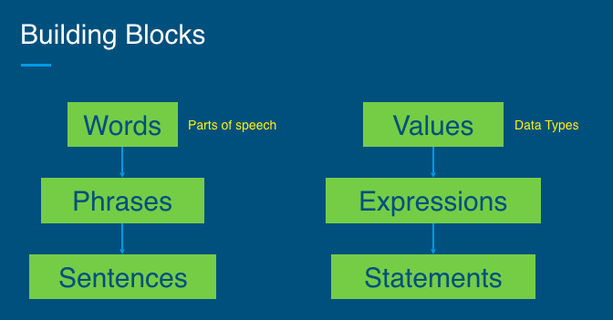

#### integer
+ integer: number without decimal point
+ Commonly abbreviated as `int`.
+ Examples
~~~~
5
-40
0
13382
~~~~
####  float
+ float: number with decimal point
+ Comes from term `floating point number`
+ Examples
~~~~
3.14159
2.0
-9.5
~~~~
+ Why does integer vs float matter?
  - Computers are faster at doing math with integers
  - Floats sometimes don’t make sense (can you be in 2.35th place?) and vice versa
#### string
+ string: sequence of characters with single quotes or double quotes
+ Commonly abbreviated as `str`
+ Examples: 
~~~~
'abcdefg'
"Hello!"
"3.14"
~~~~
+ Why single quotes vs. double quotes?
  - You can use either single or double quotes, but not the same time. 
  - If you use single quote(s) inside a pair of double quotes, the single quote(s) will be viewed as regular character(s). 
  - If you use double quote(s) inside a pair of single quotes, the double quote(s) will be viewed as regular character(s).
~~~~
"Hello World"
'Hello World'
"My name’s Alicia"
# the following is not a string
'My name's Alicia
~~~~
#### boolean
+ boolean: has value true or false
+ Commonly abbreviated as bool
+ Examples
~~~~
True
False
~~~~
+ Practice: string or boolean?
~~~~
"cookie"
False
""
''
'False'
True
~~~~

    
Click to see the answer!

    "cookie" -> string 
    False -> boolean 
    "" -> empty string 
    '' -> empty string 
    'False' -> string 
    True -> boolean

#### Why are they important?
+ Do different things
+ Example: can do arithmetic (add, subtract, multiply, divide) on integers and floats, but not on strings and booleans
+ Know what data type to know how to use it

## 3.3.4 Operators
+ Key Terms
  - **operator**: symbol performing specific computation on set of values
  - **expression**: combination of operators and values evaluating to single value
+ Evaluating expressions

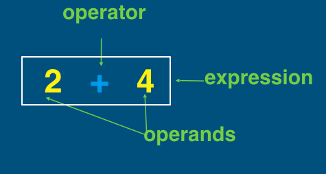

### 3.3.4.1  Arithmetic Operators
~~~~
+    Add(Adding strings together is called concatenation)
-    Subtract
*    Multiply
/    Divide
**  Exponent
~~~~
### 3.3.4.2 Floor Division
+ `//` divides two numbers and rounds result down to next integer.

+ Examples:
~~~~
5 // 2 evaluates to 2
5.0 // 2.0 evaluates to 2.0
42 // 10 evaluates to 4
9 // 9 evaluates to 1
9.0 // 9.0 evaluates to 1.0
~~~~

+ Practice
~~~~
56 // 5
60.60 // 7
3 // 3
88.123 // 9.0
~~~~

    
Click to see the answer!

    56 // 5 = 11 
    60.60 // 7 = 8.0 
    3 // 3 = 1 
    88.123 // 9.0 = 9.0 

### 3.3.4.3 Modulo

+ `%` computes remainder after division.

+ For example:
~~~~
5 % 2 evaluates to 1
5.0 % 2.0 evaluates to 1.0
24 % 10 evaluates to 4
9 % 9 evaluates to 0
9.0 % 9.0 evaluates to 0.0
~~~~

+ Practice
~~~~
56 % 5
60.0 % 7.0
3 % 3
88.5 % 9.0
~~~~

    
Click to see the answer!

    56 % 5 = 1 
    60.0 % 7.0 = 4.0 
    3 % 3 = 0 
    88.5 % 9.0 = 7.5 

### Summary
+ If any operand is float, evaluated value is float.
+ If all operands are integers, evaluated value is intege.
+ EXCEPT DIVIDE `/`, evaluated value is always float .

### 3.3.4.4 Order of Operations
+ 1. Parentheses
+ 2. Exponents
+ 3. Multiplication and Division
+ 4. Addition and Subtraction

~~~~
2 + 1 * 5 - 6 / 2 = 2 + 5 - 3 = 4

3 + (1 + 4) * 2 = 3 + 5 * 2 = 3 + 10 = 13

'a' + 'b' * 2 + 'c' = 'a' + 'bb' + 'c' = 'abbcc'
~~~~

### Summary
+ Values have different data types - can be integers, floats, booleans, or strings.
+ Can use arithmetic operators on integers and floats, concatenate strings.
+ Values and operators make up expressions.
+ Computers evaluate expressions down to single value.

## 3.3.5 Variables
### 3.3.5.1 What are they?
+ Give name to value
+ Use variables wherever would use value
+ Have only one value at any moment in time
  - But can change value!
  - Remember: left to right, top to bottom, line by line
### 3.3.5.2 Why are they important?
+ Variables allow us to use the same number multiple times in program, then change it

~~~~
# example: find the sum of 1 to 100
sum = 0
for i in range(1,101):
  sum = sum + i
print(sum)
~~~~
+ Without them, it’s not clear what a number means
~~~~
# example
NUM_OF_STUENTS = 30
~~~~
+ Makes it easier to read and understand code

### 3.3.5.3 Variable Naming
+ Letters a-z(upper/lowercase), digits 0-9, underscore (`_`)
+ Cannot begin with number
+ Cannot contain operator
+ Case sensitive
+ No spaces, separate words with underscore
+ No reserved words (technically works but will break code)
  - `reserved words`: Words used for specific purposes in Python
  ~~~~
  False 		class 		return	   is 		finally 
  None 		  if			  for 	 	   lambda	continue 
  True 		  def 		  from 	 	   while	nonlocal
  and 		  del 		  global 	   not 	  with
  as  		  elif 		  try			   or 		yield
  assert 	  else 		  import 	   pass
  break 	  except 	  in 			   raise
  ~~~~
+ Practice
~~~~
my_num
x - y
1st_num
num_1
a*b
_my_variable
~~~~

    
Click to see the answer!

    my_num ✅ 
    x - y ❌ 
    1st_num ❌ 
    num_1 ✅ 
    a*b ❌ 
    _my_variable ✅ 

#### Good naming is important!
~~~~
x1q3z9ocd = 35.0 
x1q3z9afd = 12.50
x1q3p9afd = x1q3z9ocd * x1q3z9afd
print(x1q3p9afd)
~~~~
+ What is this code doing? are the variable names good?
+ a better version
~~~~
a = 35.0 
b = 12.50 
c = a * b 
print(c)
~~~~
+ a much better one
~~~~
hours = 35.0 
rate = 12.50 
pay = hours * rate 
print(pay)
~~~~

#### Variable Assignment

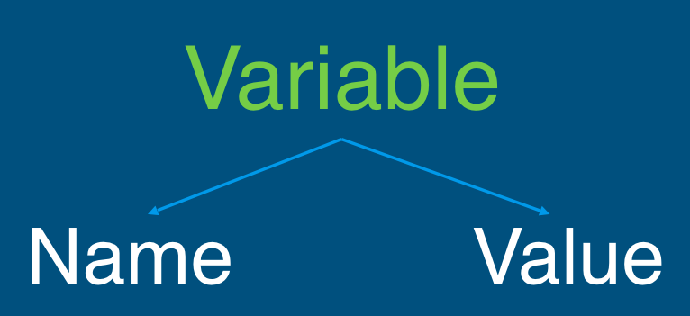

~~~~
aDescriptiveVariableName = aValue
~~~~

~~~~
# example. Note that this is an ASSIGNMENT (one equal sign =),  not checking for equivalency(two equal signs ==)
number = 5
~~~~

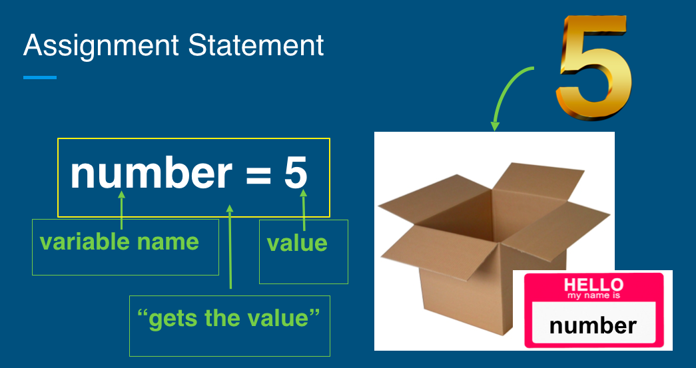

+ What's in my box?

~~~
# 
manny = 5
next_num = 9
next_num = 'goodbye'
lauren = 'purple' + 'green'
Next_num = 'hello' + next_num
manny = manny + 1.2
word = 'george'

# 
first_num = 10
second_num = first_num * 2
first_num = first_num + 2

#
a = 5.5
b = 100
temp = a
a = b
b = temp
~~~

# Summary: 
+ What did we learn? 
  - Variables
+ What are they?
  - Give name to value and variable gets assigned: `variable name = value`
  - First time variable is assigned: **declare** variable
  - Then `access` variable value with variable name
Then access variable value with variable name
+ Why are they important?
  - Know what a value is representing
  - Reuse and change value throughout program

## 3.3.6 Input Output
### 3.3.6.1 What is I/O?
+ In computing, input/output (I/O, or informally io or IO) is the communication between an information processing system, such as a computer, and the outside world, possibly a human or another information processing system.
+  Inputs are the signals or data received by the system.
+  Outputs are the signals or data sent from it.
### 3.3.6.2 Output in Python
+ Printing to the Screen
~~~~
# example 1
print("Hello World!")
# example 2
# see the space after hello, why?
name = "John"
print("Hello " + name)
~~~~

### 3.3.6.3 Input in Python
+ What if we want to replace the strings used in the examples above with anything the user entered?
+ We can use `input` function to prompt the user to type something.

~~~~
# see the \n (you can also use a space) in the end of the string, why?
name = input('What is your name?\n')
print("Hello " + name)
~~~~
+ When we run the program above, a string `What is your name?` will be displayed on the screen.
+ Once the user types their entry and hits the "enter" key...
+ The string the user enters will be stored in this variable `name` as a `string`.

### 3.3.6.4 Communicating With User
+ `input()` lets user input text.
+ `print()` outputs text to user.
+ `input()` always gives a string; if want number, use `int()` or `float()` as appropriate.

~~~~
name = input("What is your name?")
print("Hi there, " + name)
age = int(input("How old are you?"))
print("Next year, you'll be " + (age + 1) + "years old.")
~~~~
### Summary of I/0
+ What is it?
  - User providing input and receiving output
+ Why is this important?
  - Many programs and apps need user input, and based on input, program provides output
+ How (in Python)?
  - input(): get input from user
  - print(): show output to user
## 3.3.7 Comparison Operators and Conditionals

+ when `order_cost = 26.95`, which statement should we execute?
  - `print("Shipping is free!")`
  - `print("Shipping is $5.99")`

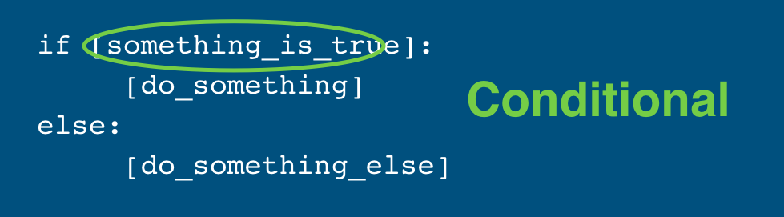

### 3.3.7.1 Comparison Operators
+ Still remember this in Mathematics?

|Operator|Meaning|
|---|---|
|<|less than|
|>|greater than|
|≤|less than or equal to|
|≥|greater than or equal to|
|=|equal to|
|≠|not equal to|

+ **Comparison Operators** in Python 

|Operator|Meaning|
|---|---|
|<|less than|
|>|greater than|
|<=|less than or equal to|
|>=|greater than or equal to|
|==|equal to|
|!=|not equal to|

+ What's up with equals?

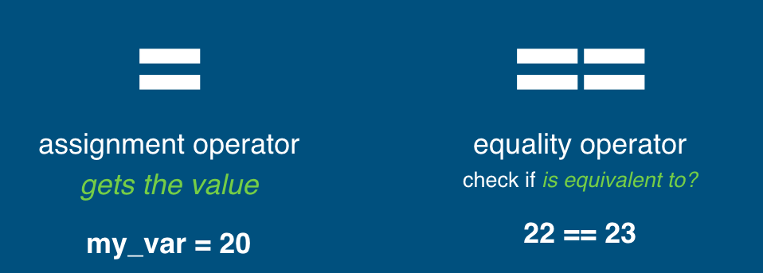

+ Practice

~~~~
5 < 6
"55" == "5" * 2
10 > 15
9 != 3 * 3
4 + 3 <= 7
'hi' == 'bye'
1 * 3 != 10 
2 != 1 + 1
~~~~

    
Click to see the answer!

    5 < 6                  True 
    "55" == "5" * 2        True 
    10 > 15                False 
    9 != 3 * 3             False 
    4 + 3 <= 7             True 
    'hi' == 'bye'          False 
    1 * 3 != 10            True 
    2 != 1 + 1             False 

### Summary of Comparison Operators
+ What are they?
  - Operators comparing values to return boolean value
+ Why are they important?
  - Compare values and make decisions based on evaluated outcome
  
## 3.3.8 Logical Operators
### Questions: True or False
+ Are your favorite activities hiking `AND` traveling?
+ Have you had coffee `OR` tea this morning?
+ Are you `NOT` excited for the weekend?
+ Do we have Monday `AND` `NOT` Tuesday off for Labor Day?

### 3.3.8.1 What are Logical Operators?
+ Reminder: Arithmetic operators (`+`, `-`, `*`, `/`) to combine numbers
+ Logical operators: combine booleans
  - `and`
  - `or`
  - `not`
#### Logical Operators: `AND`
+ `AND` returns true only if both operands are true.

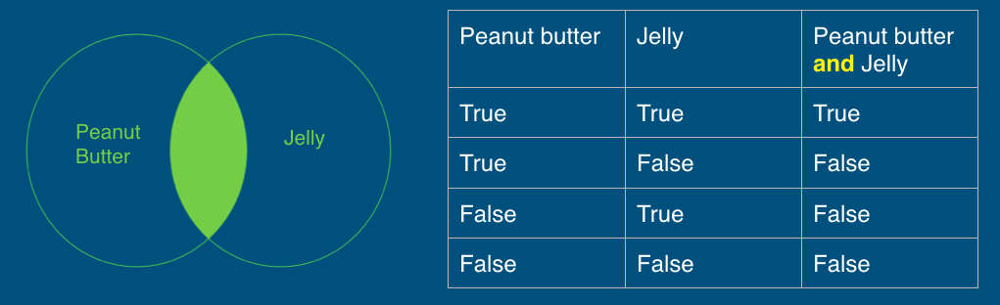

+ Practice: Milkshake Time!
~~~~
vanilla = True
chocolate = True
strawberry = False

vanilla and strawberry
vanilla and chocolate
chocolate and vanilla
chocolate and strawberry
strawberry and strawberry
~~~~

    
Click to see the answer!

    vanilla and strawberry      False 
    vanilla and chocolate       True 
    chocolate and vanilla       True 
    chocolate and strawberry    False 
    strawberry and strawberry   False

#### Logical Operators: `OR`
+ `OR` returns true if either (or both) operand is true.

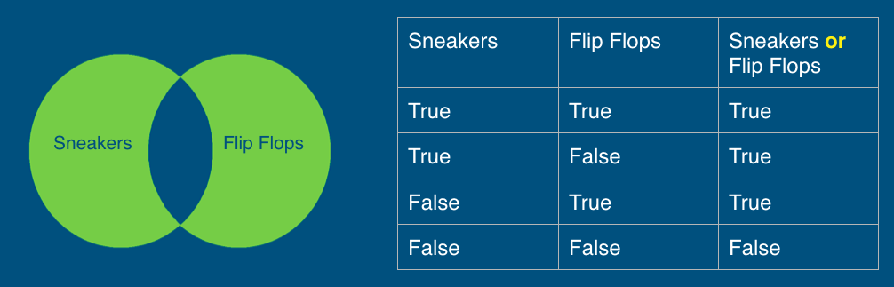

+ Practice: Outdoor Activities!
~~~~
hiking = True
running = False
biking = False

hiking or running
hiking or biking
biking or hiking
biking or running
running or biking
~~~~

    
Click to see the answer!

    hiking or running      True 
    hiking or biking       True 
    biking or hiking       True 
    biking or running      False 
    running or biking      False

#### Logical Operators: `NOT`
+ `NOT` inverts (gives opposite value of) the value of its operand.

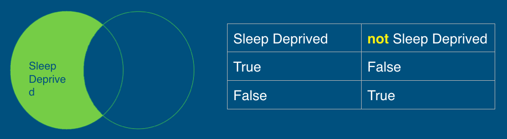

+ Practice: Favorite Colors!
~~~~
blue = True
red = False
green = True

not blue
not red
not green
~~~~

    
Click to see the answer!

    not blue    False   
    not red     True    
    not green   False   

#### How is `not` different from `and` and `or`?

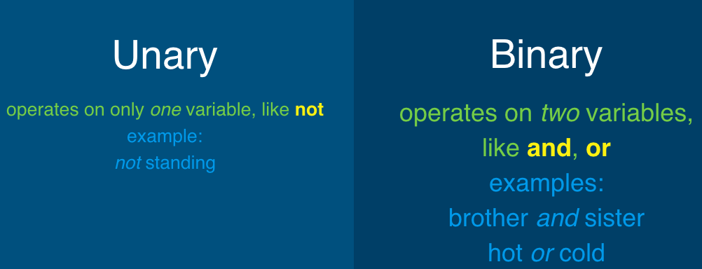

#### Combining Operators

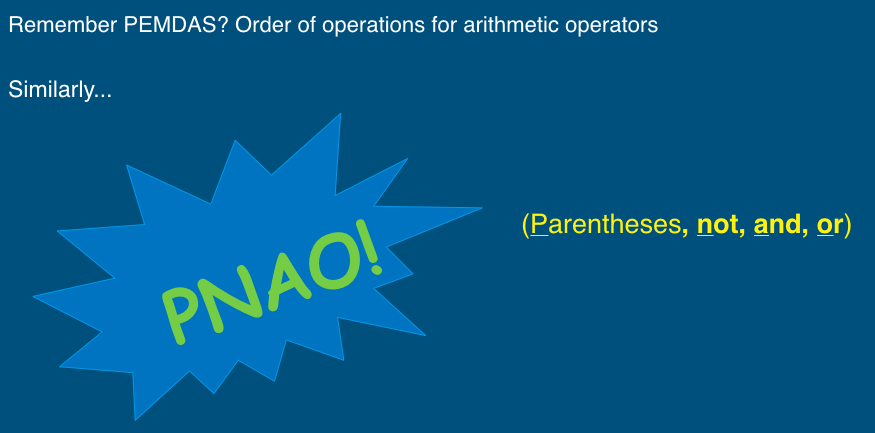

+ Practice 1:
~~~~
True and not False
(False or True) and False
not (True or False) or True
~~~~

    
Click to see the answer!

    True and not False                 True 
    (False or True) and False          False 
    not (True or False) or True        True

+ Practice 2:  Animals on a Farm!
~~~~
dog = False
chicken = True
sheep = True

not dog or not chicken and sheep
chicken and dog or not sheep
not chicken or not sheep or dog
dog and not sheep or chicken 
~~~~

    
Click to see the answer!

    not dog or not chicken and sheep     True 
    chicken and dog or not sheep         False  
    not chicken or not sheep or dog      False 
    dog and not sheep or chicken         True

+ Practice 3: Find the bug in the following code.
~~~~
answer = input("What city is Fisk in?")
if answer == "nashville" or "Nashville":
  print("Correct!")
~~~~

    
Click to see the correct code!

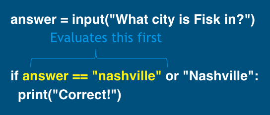

  
    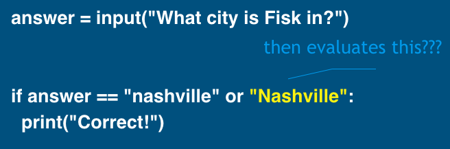
  
    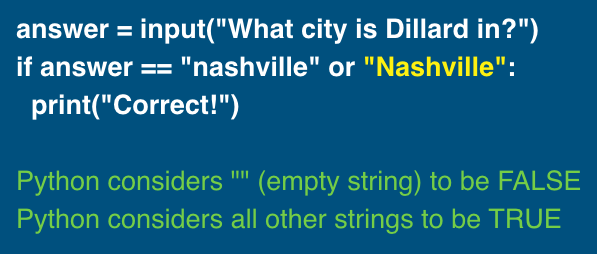
  
  
    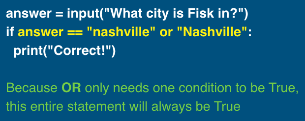

    
Click to see the correct code!

    answer = input("What city is Fisk in?")
    if answer == "nashville" or answer == "Nashville":
      print("Correct!")

# References
+ [Assembly - Introduction](https://www.tutorialspoint.com/assembly_programming/assembly_introduction.htm)
+ [Higher level and lower level languages](https://computersciencewiki.org/index.php/Higher_level_and_lower_level_languages)
+ [Interpreter](https://en.wikipedia.org/wiki/Interpreter_(computing))
+ [Web Application](https://en.wikipedia.org/wiki/Web_application)
