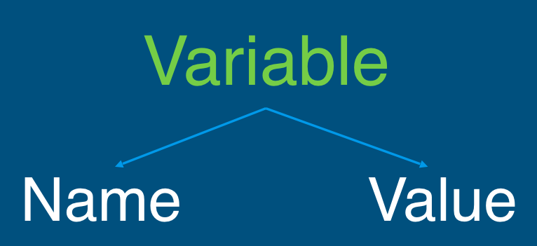
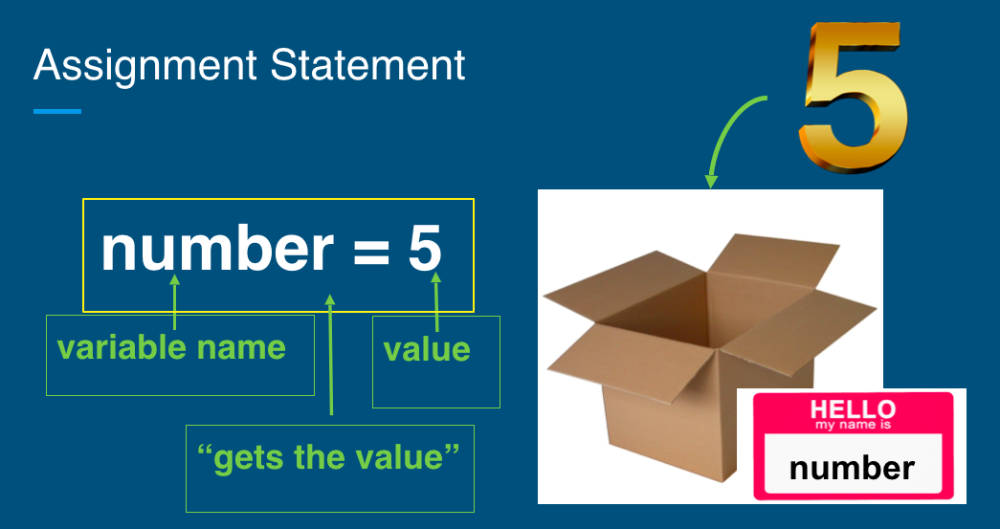

## 3.3.5 Variables
### 3.3.5.1 What are they?
+ Give name to value
+ Use variables wherever would use value
+ Have only one value at any moment in time
  - But can change value!
  - Remember: left to right, top to bottom, line by line
### 3.3.5.2 Why are they important?
+ Variables allow us to use the same number multiple times in program, then change it

~~~~
# example: find the sum of 1 to 100
sum = 0
for i in range(1,101):
  sum = sum + i
print(sum)
~~~~
+ Without them, it’s not clear what a number means
~~~~
# example
NUM_OF_STUENTS = 30
~~~~
+ Makes it easier to read and understand code

### 3.3.5.3 Variable Naming
+ Letters a-z(upper/lowercase), digits 0-9, underscore (`_`)
+ Cannot begin with number
+ Cannot contain operator
+ Case sensitive
+ No spaces, separate words with underscore
+ No reserved words (technically works but will break code)
  - `reserved words`: Words used for specific purposes in Python
  ~~~~
  False 		class 		return	   is 		finally 
  None 		  if			  for 	 	   lambda	continue 
  True 		  def 		  from 	 	   while	nonlocal
  and 		  del 		  global 	   not 	  with
  as  		  elif 		  try			   or 		yield
  assert 	  else 		  import 	   pass
  break 	  except 	  in 			   raise
  ~~~~
+ Practice
~~~~
my_num
x - y
1st_num
num_1
a*b
_my_variable
~~~~

    
Click to see the answer!

    my_num  ✅ 
    x - y ❌ 
    1st_num ❌ 
    num_1 ✅ 
    a*b ❌ 
    _my_variable ✅ 

#### Good naming is important!
~~~~
x1q3z9ocd = 35.0 
x1q3z9afd = 12.50
x1q3p9afd = x1q3z9ocd * x1q3z9afd
print(x1q3p9afd)
~~~~
+ What is this code doing? are the variable names good?
+ a better version
~~~~
a = 35.0 
b = 12.50 
c = a * b 
print(c)
~~~~
+ a much better one
~~~~
hours = 35.0 
rate = 12.50 
pay = hours * rate 
print(pay)
~~~~

#### Variable Assignment

~~~~
aDescriptiveVariableName = aValue
~~~~

~~~~
# example. Note that this is an ASSIGNMENT (one equal sign =),  not checking for equivalency(two equal signs ==)
number = 5
~~~~

+ What's in my box?

~~~
# 
manny = 5
next_num = 9
next_num = 'goodbye'
lauren = 'purple' + 'green'
Next_num = 'hello' + next_num
manny = manny + 1.2
word = 'george'

# 
first_num = 10
second_num = first_num * 2
first_num = first_num + 2

#
a = 5.5
b = 100
temp = a
a = b
b = temp
~~~

# Summary: 
+ What did we learn? 
  - Variables
+ What are they?
  - Give name to value and variable gets assigned: `variable name = value`
  - First time variable is assigned: **declare** variable
  - Then `access` variable value with variable name
Then access variable value with variable name
+ Why are they important?
  - Know what a value is representing
  - Reuse and change value throughout program
